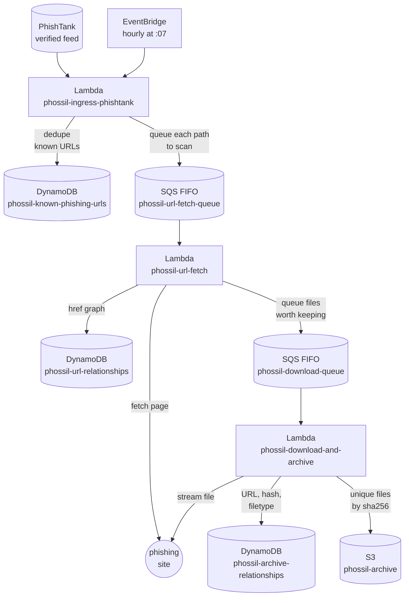

# phossil

phossil monitors confirmed phishing sites for minor mistakes which expose the kit's source code - then saving it for later analysis.

[](https://github.com/tweedge/phossil)
[](https://github.com/psf/black)
[](https://chris.partridge.tech/)

## What is This?

PhishTank publishes a feed of verified phishing URLs every hour. Most anti-phishing projects use that feed to block sites. phossil uses it as a to-do list: every confirmed phishing site gets visited, crawled, and picked apart, and anything sitting on the site that looks like part of a phishing kit gets archived for later analysis.

The reason is simple: phishing kits are sloppy. Kit authors ship archive passwords in plaintext, leave `cpanel` credentials in configs, hardcode their Telegram bot tokens, and log every victim's credentials to a database that ends up in the zip. If you can grab the kit before the site is taken down, you get all of it - the kit's source, its infrastructure, and occasionally the kit author's own information. Over the last four and a half years this pipeline has been running around the clock, it has archived roughly 1,200 phishing kits this way. I'm slowly working through reviewing and publishing them.

## How It Works

Three Lambdas pass work to each other through FIFO SQS queues:

1. **Ingress** (`phossil-ingress-phishtank`) runs hourly via EventBridge, pulls PhishTank's verified feed, deduplicates URLs against DynamoDB, then expands each URL into every path component (so `example.com/login/verify/account.php` also gets `example.com`, `example.com/login/`, and so on scanned - kit landing pages often live one directory up from the reported link).
2. **URL fetch** (`phossil-url-fetch`) downloads each queued page, records every `href` relationship it finds into DynamoDB, and queues any same-domain links ending in extensions worth keeping (archives, executables, installers, scripts, documents, environment files).
3. **Download and archive** (`phossil-download-and-archive`) streams each queued file to disk, infers the real filetype, hashes it with SHA256, records the URL-to-digest relationship in DynamoDB, and uploads it to S3 unless the exact file is already archived.



A few design decisions worth calling out:

* **Everything is deduplicated by content.** The same kit zipped ten times and hosted on ten domains is stored once in S3, keyed by its SHA256 digest.
* **Nothing off-domain is downloaded.** A phishing page linking to `cdn.example-cdn.com/malware.zip` will be recorded as a relationship, but the file won't be fetched.
* **Queues are FIFO with content-based deduplication**, so a site submitted twice in the same hour is only scanned once.
* Both worker queues have dead letter queues, so a file that crashes the download Lambda three times doesn't silently vanish.

## Receipts

phossil ran continuously in us-east-2 from March 26, 2022 until I republished it here in September 2026 - 4.5 years without missing an hourly PhishTank run. What it collected in that time:

| Metric | Count |
|---|---|
| Unique confirmed phishing URLs seen and deduplicated | 1,179,865 |
| Link relationships mapped between phishing pages | 13,513,179 |
| Files downloaded from confirmed phishing sites for analysis | 13,438 |

The downloaded files break down into a long tail of phishing kits (`.zip`, by far the most common), PDFs masquerading as invoices or delivery notices, APK droppers, and the occasional `.env` or `web.config` the kit author forgot to protect. Roughly 1,200 of those archives are real, distinct phishing kits - the rest are duplicate uploads, victim-facing documents, and other malware that was squatting on the same hosting.

If you're an investigator who needs comprehensive kit coverage, use [StalkPhish](https://github.com/t4d/StalkPhish) or [PhishingKitHunter](https://github.com/t4d/PhishingKitHunter) - both are great tools and cover targets more thoroughly than phossil does. phossil was built to be cheap, set-and-forget infrastructure that reliably gets *something* from *every* confirmed site, not to be the deepest crawler on the market.

## Deploying Your Own

The whole system is defined in [AWS CDK](https://aws.amazon.com/cdk/) (`phossil/phossil_stack.py`) - there is no click-ops, no shell build script, and every resource below is created for you.

### Requirements

* An AWS account, and credentials configured locally (an AWS profile works well)
* Python 3.9+ with `venv`
* Node.js 18+ and the CDK CLI: `npm install -g aws-cdk`
* Docker, if you have it. The Lambda code and its dependencies are bundled by CDK through the official Lambda build image when Docker is available. If you don't have Docker, that's fine too - phossil's dependencies are pure Python, so CDK falls back to installing wheels for the Lambda's target platform locally.

### Install

```bash
git clone https://github.com/tweedge/phossil.git
cd phossil
python3 -m venv .venv && source .venv/bin/activate
pip install -r requirements.txt
```

Bootstrap CDK in the region you want to run in (us-east-1 is the default), then deploy:

```bash
cdk bootstrap aws://<account-id>/us-east-1
cdk deploy
```

That's it. On the next hour boundary, EventBridge fires ingress, PhishTank gets pulled, and sites start flowing through the pipeline.

### Configuration

Everything important is adjustable with CDK context flags:

```bash
# Deploy to a different region
cdk deploy -c region=us-east-2

# Keep DynamoDB tables and the archive bucket if the stack is ever deleted
# (strongly recommended once you're collecting real data!)
cdk deploy -c removalPolicy=retain
```

By default tables and the archive bucket are deleted with the stack so you can try phossil risk-free and `cdk destroy` without leftovers. Flip `removalPolicy=retain` before you've collected anything you care about, or you will be sad.

Resource sizing follows the original deployment, with two deliberate upgrades:

* Lambdas run on **Python 3.14** on **arm64 (Graviton)** - the original ran Python 3.9, which AWS has since deprecated.
* The archive bucket uses an [account-regional namespace](https://docs.aws.amazon.com/AmazonS3/latest/userguide/gpbucketnamespaces.html), so its name is scoped to your account and region (`phossil-archive-<account>-<region>-an`) and can never be claimed by another account.

### Things You Should Know Before Running This

* **PhishTank is rate-limited.** The public feed allows roughly one download per hour per source IP, which lines up nicely with the hourly schedule. If ingress occasionally logs an HTTP error from the feed (PhishTank's CDN is imperfect), nothing breaks - the next hour's run will catch up, since URLs are deduplicated in DynamoDB.
* **This is active scanning.** You'll be making requests to live phishing sites, usually hosted by people who did not ask whether that's okay, and sometimes hosted by bulletproof hosts who won't appreciate it. Run this from cloud infrastructure you're authorized to use, don't do it from your home IP or your employer's network without thinking it through first.
* **Costs are small but nonzero.** DynamoDB on-demand, SQS, Lambda, and S3 for this workload have cost me single-digit dollars per month. The table sizes grow slowly (about 1.18M rows over 4.5 years); the S3 bucket grows with however many files the internet throws at you.
* **Log retention is set to three months** to keep CloudWatch costs down. Adjust `log_retention` in `phossil/phossil_stack.py` if you want longer.

## License

Apache License 2.0 - see [LICENSE](LICENSE).

Stay safe out there,

tweedge
