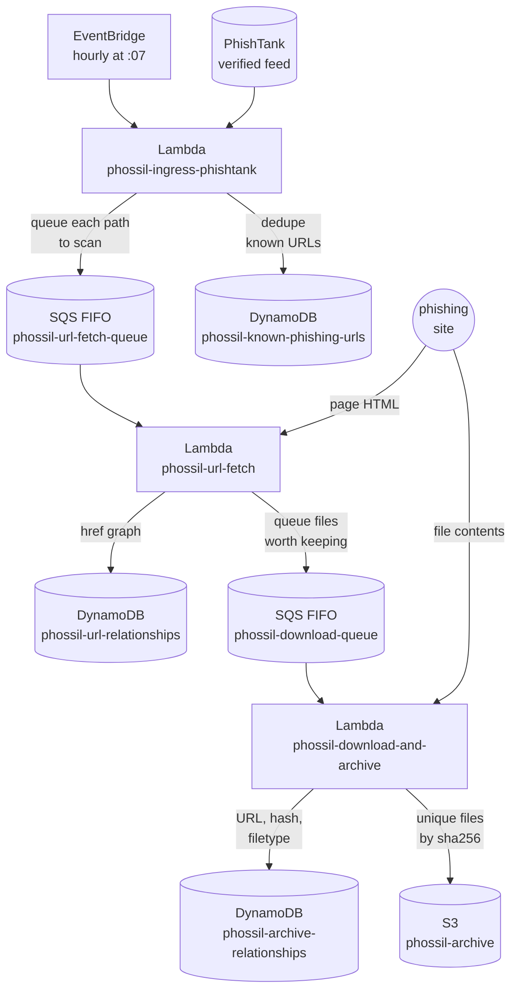

# phossil

[](https://github.com/tweedge/phossil)
[](https://github.com/psf/black)
[](https://chris.partridge.tech)
[](https://bsky.app/profile/tweedge.net)
[](https://cybersecurity.theater/@tweedge)

phossil monitors confirmed phishing sites for mistakes which expose the kit's source code - then saves it for later analysis.

## What is This?

Tools like [StalkPhish](https://github.com/t4d/StalkPhish) help you find mistakes authors make when deploying individual phishing kits. However, attackers are usually not complete idiots, and don't always make a lot of mistakes. If attackers only make a mistake 0.1% of the time, what can you do?

*Add time.*

phossil is designed to run unattended, automatically finding and downloading files which could be phishing kits. PhishTank publishes a feed of verified phishing URLs every hour, which phossil reads. Most anti-phishing projects use that feed to block sites. phossil uses it as a to-do list: every confirmed phishing site gets visited, crawled, and anything sitting on the site that looks like part of a phishing kit gets archived for later analysis. It takes a simple, lightweight approach which usually doesn't turn up anything (exploring all paths down to the root from where the phishing page was reported) - but when running for months or years, you'll find hundreds or thousands of exposed kits.

Eventually, a running phossil instance turns into a gold mine of data about attackers. Phishing kits are often deployed via zips, and over time, those zips get sloppy as kits move from host to host - many ship archive passwords in plaintext, leave `cpanel` credentials in configs, hardcode their Telegram bot tokens, and sometimes log test or victim data. If you can grab the kit before the site is taken down, you get all of it - the kit's source, its infrastructure, and occasionally the kit author's own information. 

Over the last four and a half years this pipeline has been running around the clock, it has archived roughly 1,200 phishing kits this way. I'm slowly working through reviewing and publishing them.

## How It Works

phossil is designed to be deployed to AWS, but the actual architecture is dead simple and can be forked/remixed/etc. to run anywhere. Today, three Lambdas pass work to each other through FIFO SQS queues:

1. **Ingress** (`phossil-ingress-phishtank`) runs hourly via EventBridge, pulls PhishTank's verified feed, deduplicates URLs against DynamoDB, then expands each URL into every path component (so `example.com/login/verify/account.php` also gets `example.com`, `example.com/login/`, and so on scanned - kit landing pages often live one directory up from the reported link).
2. **URL fetch** (`phossil-url-fetch`) downloads each queued page, records every `href` relationship it finds into DynamoDB, and queues any same-domain links ending in extensions worth keeping (archives, executables, installers, scripts, documents, environment files).
3. **Download and archive** (`phossil-download-and-archive`) streams each queued file to disk, infers the real filetype, hashes it with SHA256, records the URL-to-digest relationship in DynamoDB, and uploads it to S3 unless the exact file is already archived.



A few design decisions worth calling out:

* Everything is deduplicated by content. The same kit zipped ten times and hosted on ten domains is stored once in S3, keyed by its SHA256 digest.
* Nothing off-domain is downloaded. A phishing page linking to `cdn.example-cdn.com/malware.zip` will be recorded as a relationship, but the file won't be fetched.
* Queues are FIFO with content-based deduplication, so a site submitted twice in the same hour is only scanned once.
* Both worker queues have dead letter queues, so a file that crashes the download Lambda three times doesn't silently vanish.

## Receipts

phossil has been running continuously since March 26, 2022 - 4.5 years without missing an hourly PhishTank run. What it collected in that time:

| Metric | Count |
|---|---|
| Unique confirmed phishing URLs seen and deduplicated | 1,179,878 |
| Link relationships mapped between phishing pages | 13,513,179 |
| Unique downloaded from confirmed phishing sites for analysis | 13,438 |
| Confirmed unique phishing kits | ~1,200 |

Given that many kits contain logs and some contain victim information, I am hand-validating, roughly labeling, and redacting these before I release them publicly - likely as the largest phishing kit dataset in existence. Redacting these by hand has been a multi-month project and I'm hoping to be done before the end of the year.

## Deploying Your Own

The whole system is defined in [AWS CDK](https://aws.amazon.com/cdk/) (`phossil/phossil_stack.py`) - there is no click-ops, no shell build script, and every resource below is created for you.

### Requirements

* An AWS account, and credentials configured locally (an AWS profile works well)
* Python 3.9+ with `venv`
* Node.js 18+ and the CDK CLI: `npm install -g aws-cdk`
* Docker, if you have it. The Lambda code and its dependencies are bundled by CDK through the official Lambda build image when Docker is available. If you don't have Docker, that's fine too - phossil's dependencies are pure Python, so CDK falls back to installing wheels for the Lambda's target platform locally.

### Install

```bash
git clone https://github.com/tweedge/phossil.git
cd phossil
python3 -m venv .venv && source .venv/bin/activate
pip install -r requirements.txt
```

Bootstrap CDK in the region you want to run in (us-east-1 is the default), then deploy:

```bash
cdk bootstrap aws://<account-id>/us-east-1
cdk deploy
```

That's it. On the next hour boundary, EventBridge fires ingress, PhishTank gets pulled, and sites start flowing through the pipeline.

### Configuration

Everything important is adjustable with CDK context flags:

```bash
# Deploy to a different region
cdk deploy -c region=us-east-2

# Keep DynamoDB tables and the archive bucket if the stack is ever deleted
# (strongly recommended once you're collecting real data!)
cdk deploy -c removalPolicy=retain
```

By default tables and the archive bucket are deleted with the stack so you can try phossil risk-free and `cdk destroy` without leftovers. Set `removalPolicy=retain` once you've collected anything you care about, or you will be sad.

Resource sizing follows the original deployment, with two deliberate upgrades:

* Lambdas run on **Python 3.14** on **arm64 (Graviton)** - the original ran Python 3.9, which AWS has since deprecated.
* The archive bucket uses an [account-regional namespace](https://docs.aws.amazon.com/AmazonS3/latest/userguide/gpbucketnamespaces.html), so its name is scoped to your account and region (`phossil-archive-<account>-<region>-an`) and can never be sniped.

### Things You Should Know

Before you run phossil, be aware ...

* **PhishTank is rate-limited.** The public feed allows roughly one download per hour per source IP, which lines up nicely with the hourly schedule. If ingress occasionally logs an HTTP error from the feed (PhishTank's CDN is imperfect), nothing breaks - the next hour's run will catch up, since URLs are deduplicated in DynamoDB.
* **This is active scanning.** Your Lambdas will be making requests to live, known phishing sites (rate limited and deduplicated ones, but still: live requests to known phishing sites). This won't work on networks where phishing sites are blocked - such as if you build and try running a local version on your home network, but have PiHole, content filtering, etc. enabled. Don't try running phossil on sensitive networks, your employer's infrastructure, or so on without thinking it through first.
* **Costs are small but nonzero.** Across 4.5 years of running, phossil averaged about **$1.20/month** - almost all of it S3 storage and DynamoDB request units, with Lambda, SQS, CloudWatch, and EventBridge effectively free under the always-on free tier. The table sizes grow slowly (about 1.18M rows over 4.5 years); the S3 bucket grows with however many files the internet throws at you. You can absolutely do phossil cheaper by running it yourself on a mini PC or homelab, though that was going to conflict with my IDS/IPS, so I moved this idea to the cloud.
* **Log retention is set to three months** to keep CloudWatch costs down. Adjust `log_retention` in `phossil/phossil_stack.py` if you want longer.

## Querying Your Data

`tools/phossil` is a CLI for asking questions of the tables phossil builds - lookups, breakdowns, and full exports. It only needs boto3:

```bash
pip install -r tools/requirements.txt
```

The highlights:

```bash
# everything known about a site: known URLs, archive hits, optionally the link graph
python3 tools/phossil where phish.test --profile tweedge --region us-east-2

# distinct files with source counts - the same kit hosted at 10 domains shows up once, count 10
python3 tools/phossil digests --dups-only

# what got downloaded, by category and filetype, including where the URL lied about the content
python3 tools/phossil filetypes
python3 tools/phossil filetypes --mismatches

# all archived files whose source URL matches a substring
python3 tools/phossil kits netlify --category Archives

# one row by digest, relationship_id, or source URL - keys are derived the same way the Lambdas do it
python3 tools/phossil key --fetched https://site/login/ --original https://site/login --href https://site/kit.zip
python3 tools/phossil get 2a2b01f796d12e11f8feeb85cc0f401b247b0a07cecf17faa3a5964af04e2cfe

# point-and-shoot health check: table counts, distinct digests, queue depths, archive size
python3 tools/phossil stats

# get the data out for real analysis - SQLite gives you SQL over 13.5M link rows
python3 tools/phossil export relationships --format sqlite --out links.sqlite --yes
```

Also in there: `relationships` (hrefs out of, or `--to` for inbound), `crawl-tree` (reconstructs the path-prefix scan frontier for a reported URL), `fqdn-stats` (top domains in the known-URL table), and `export --format json|csv` with `--where col=value` filters. Run any command with `--help` for the fine print. Two things to know: the link-graph table has no secondary indexes, so `where --include-relationships`, `relationships`, and `crawl-tree` run full parallel scans (~$2-4 of read capacity per pass over 13.5M rows, and the CLI asks before doing it), and everything else is penny-territory. Global flags (`--profile`, `--region`, `--output json`, `--segments`) work before or after the subcommand.

## Contributing

I welcome contributions to phossil though it's not a main focus of mine right now, please fork and enjoy, and create issues or PRs as you see fit. :)
